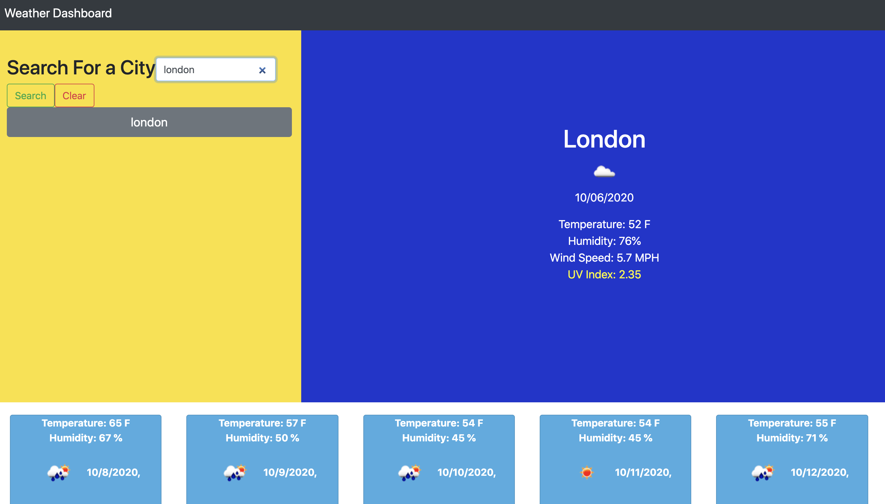

Weather Dashboard: Homework - 06:

For the weather Dashboard I tried to follow the format of the supplied asset. My weather dashboard successfully does searches of any valid locations in the weather API, it gives a five day forecast for that location, and it stores your recent searches until decide to clear them. 

This weather app could be useful for people traveling to a new location or just wanting to utilize it for the weather in their current location. 

I used Jquery and DayJS() in this assignment. A majority of my material on the page has been created dynamically in the script.js section and I find this method of document design to be much easier. 

I will note that I did not make use of a for loop when creating the 5 day weather forecast, the reason being is that I hard coded and had successful data outputs and when I realized I could do a for loop, I tried and did not have successful data outputs. In the future I would definitely do a for loop, but being that my weather app does operate successfully I am satisfied with the extra work it took to hard code all of that information.

I found this assignment in all to be the first time that I have successfully used psuedocoding. I was pretty much on my own for the entirety of the assignment aside from the help of peers here and there. 

Github repository: https://github.com/meusjoseph21/weather-dashboard-06

Github Deployed Page: https://meusjoseph21.github.io/weather-dashboard-06/

